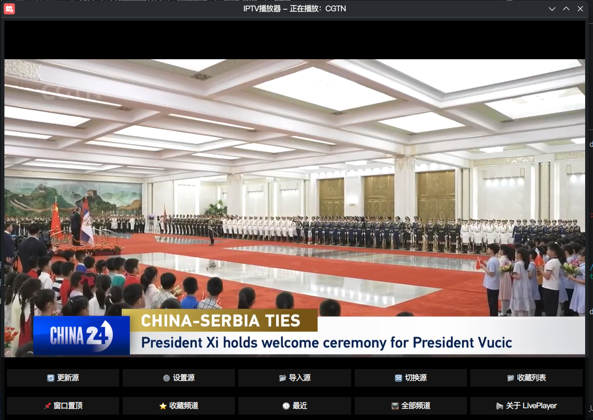
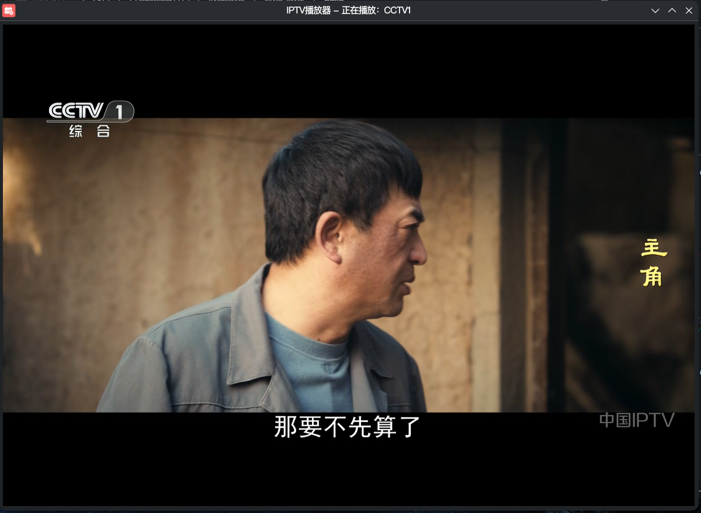

LivePlayer 直播播放器
基于 Qt6 + mpv 开发的轻量级直播播放器，支持本地导入、在线更新直播源，简洁稳定。

✨ 功能特性
✅ 内嵌视频播放
视频直接嵌入窗口，无多余控件，播放流畅稳定
✅ 隐藏播放控制条
纯播放界面，无干扰、沉浸式观看
✅ 切换频道自动停止上一个播放
无串音、无卡顿、不残留进程
✅ 本地 TXT 直播源导入
支持 频道名,直播地址 格式文本，一键导入
✅ 在线更新直播源
支持在线 M3U 直播源自动解析加载
✅ 最近观看记录
自动保存最近 20 条播放记录，快速回看

📌 支持的源格式
本地 TXT 格式（每行一条）
plaintext
CCTV1,http://example.com/stream.m3u8
湖南卫视,http://example.com/hunan.m3u8
在线 M3U 格式
通用 IPTV 直播源，自动解析频道名称与地址
🛠 运行环境
Linux 系统
必须安装 mpv 播放器
Qt 6 运行环境
🚀 使用方法
打开软件
选择 本地导入 TXT 或 在线更新直播源
左侧点击频道 → 自动播放
切换频道自动停止上一路播放
自动记录最近观看记录
🎯 软件亮点
超轻量、启动快
无广告、无后台
纯本地运行，保护隐私
兼容所有 mpv 支持的直播流
操作简单，老人小孩都会用
📌 说明
画中画、频道自动分类功能 开发中
播放依赖系统 mpv，需提前安装
